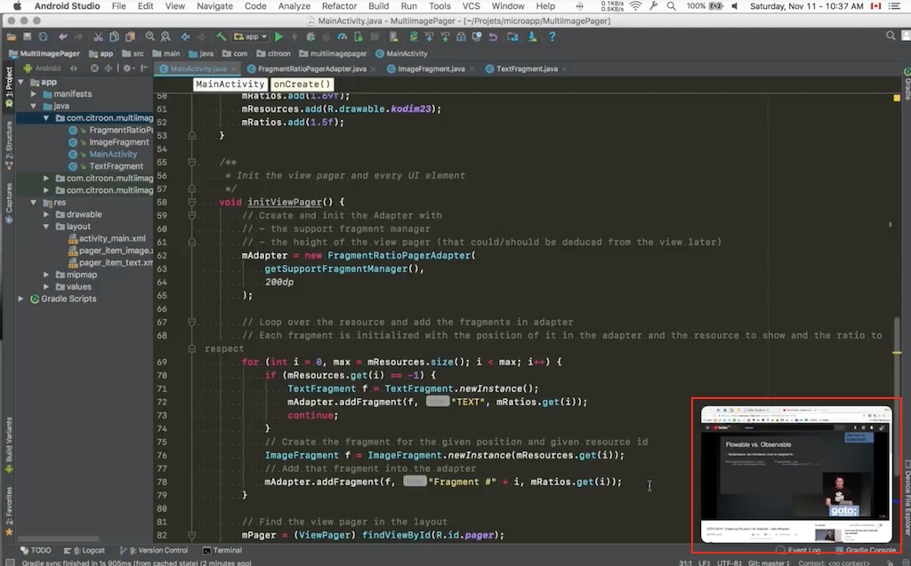

# PIP all the apps

Hello, this is Picture in picture for all the Apps (macos specific)

This project allows you to get a visual overview of an app with a small picture-in-picture window preview,
have a look at the video to understand:
https://www.youtube.com/watch?v=mw05zJoNZrU&list=PLfkRO2tWR5vTsJaymnm3VBCES6eSRn452&index=1

It works quite well even with videos. It could be battery intensive by design. This apps uses multiple tricks but there is no other way to do it (so far).

It has the sub-region selection so you can capture only a part of a window if you need.

I would say it is feature complete but need some serious design work.

I won't develop it further so you can take it and push it to the next step!

Enjoy!

